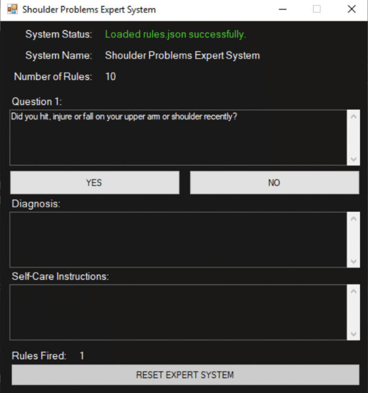
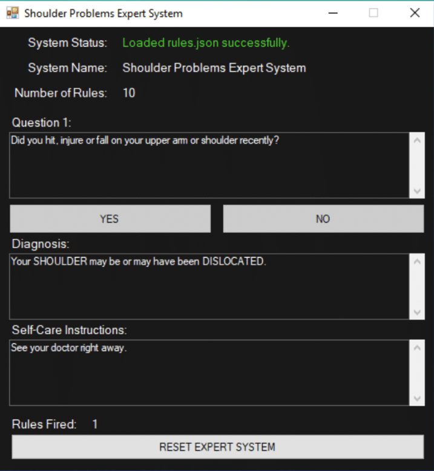
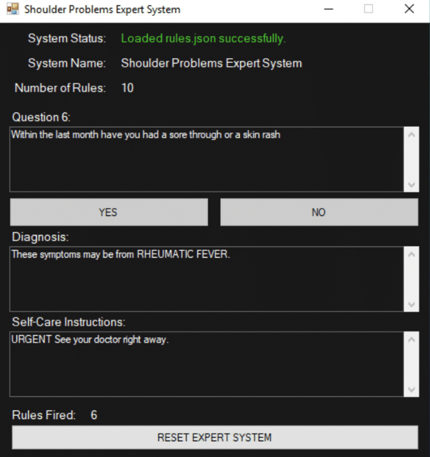
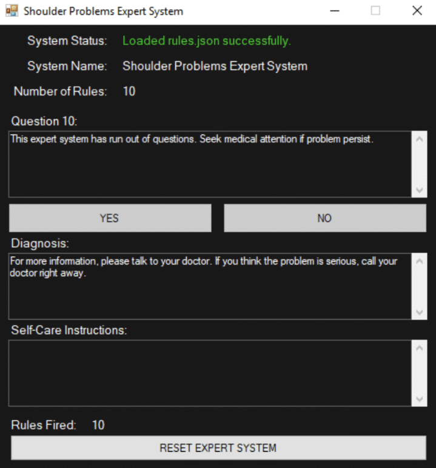

# C# Expert System
This is an expert system built using C#. It is an adapatation of the expert system using CLIPS that is shown in this publication below.

[An Expert System for Shoulder Problems Using CLIPS](https://www.researchgate.net/publication/303388345_An_expert_system_for_shoulder_problems_using_CLIPS)

This expert system is designed to help the user to self-diagnose a shoulder injury. The expert system uses the Forward Chaining method of finding the correct response to the user's needs. Based on the answers provided by the user it will either come to a conclusion or ask for more information. The [rules.json](ShoulderExpertSystem/rules.json) file is the knowledge base that the expert system uses for gather information and making conclusions.

# Using the Expert System
When the application is opened it will load the knowledgebase automatically if found and start the process of diagnosing the issue.

##### Figure 1: Application opened

The system status tells whether or not the knowledgebase was loaded correctly. The system name is pulled from the knowledgebase in order to make the program dynamic allowing it to just swap out the knowledgebase for another. Number of rules is the amount of rules that the knowledgebase has for the expert system to use. The questions are simple yes/no answers and forward chain to the next question/conclusion.

Figure 2 & 3 show a conslusion being made by the expert system based on the answers given by the user. Figure 4 shows when the expert sytem runs out of rules that can be used and cannot continue gathering information.

##### Figure 2: Conclusion is made after 1 question asked.

##### Figure 3: Conclusion is made after 6 questions asked.

##### Figure 4: Run out of rules, conclusion cannot be made
